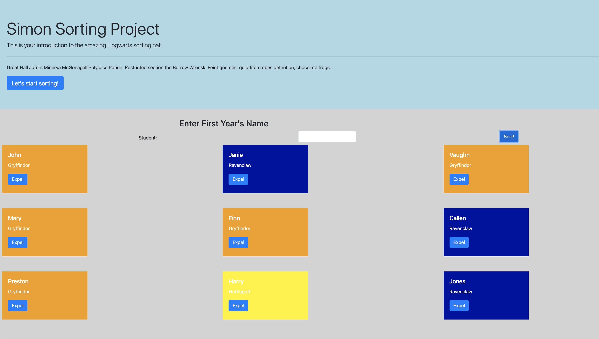

# Sorting Hogwarts Newbies

## Description
This project is an exploration into using event listeners, forms, and dynamically printing content to the page. It also introduces the use of auto-generated random IDs and color-coding new objects in an array as well as the ability to remove items from the array dynamically. Instructions can be found [here](https://github.com/nss-nightclass-projects/exercise-vault/blob/master/EVENTS_sorting_hat.md). 

## Screenshots
##### Home Page

## How to Run
1. Clone down this repo.
1. Make sure you have http-server installed via npm. If not, get it [here](https://www.npmjs.com/package/http-server).
1. On your command line, run `hs -p 9999`.
1. In your browser, navigate to `http://localhost:9999`.
